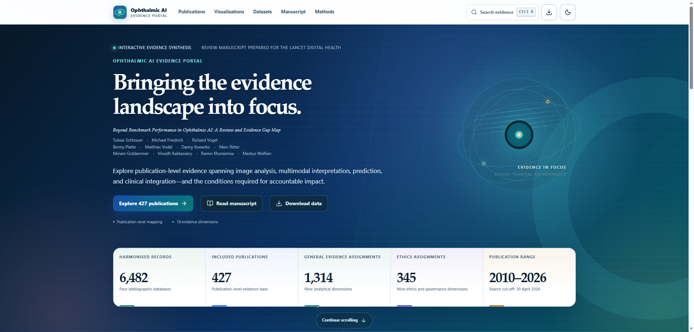

# Ophthalmic AI Evidence Portal

A static, interactive companion to **Beyond Benchmark Performance in Ophthalmic AI: A Review and Evidence Gap Map**. The portal supports publication-level exploration of ophthalmic AI across image analysis, multimodal interpretation, prediction, clinical integration, and governance.




## Evidence at a glance

| Measure | Current portal |
| --- | ---: |
| Harmonised records | 6,482 |
| Included publications | 427 |
| Dataset registry records | 20 |
| General evidence assignments | 1,314 |
| Ethics and governance assignments | 345 |
| Publication range | 2010–2026 |
| Search cut-off | 30 April 2026 |

The evidence maps cover nine general dimensions and nine ethics and governance dimensions. Multiple assignments may apply to one publication.


## Explore the portal

- Browse and filter 427 publication profiles.
- Explore publication timelines, evidence-gap maps, distributions, dataset reuse, and other visual evidence views.
- Search 20 dataset registry records and follow their links to included publications.
- Consult the methods and interpretation guidance.
- Search the portal and download public metadata, evidence assignments, dataset records, visualisation values, and field definitions.
- Read the main manuscript and supplementary material.


## How to cite

If you use this review or its companion evidence portal, please cite:

Schlosser, T., et al. (2026). *Beyond Benchmark Performance in Ophthalmic AI: A Review and Evidence Gap Map*. Ophthalmic AI Evidence Portal: https://tschlosser13.github.io/ophthalmic-ai-evidence-portal/.

```bibtex
@misc{schlosser2026ophthalmicai,
  author = {Schlosser, Tobias
            and Friedrich, Michael
            and Vogel, Richard
            and Platte, Benny
            and Vodel, Matthias
            and Kowerko, Danny
            and Ritter, Marc
            and Goldammer, Miriam
            and Kakkassery, Vinodh
            and Khoramnia, Ramin
            and Wolfien, Markus},
  title  = {Beyond Benchmark Performance in Ophthalmic {AI}: A Review and Evidence Gap Map},
  year   = {2026},
  url    = {https://tschlosser13.github.io/ophthalmic-ai-evidence-portal/}
}
```

